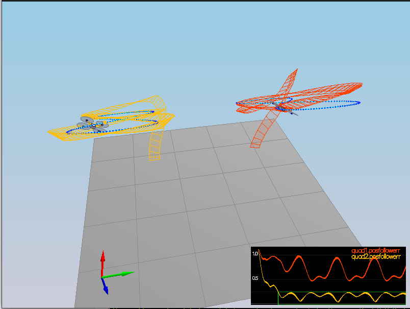
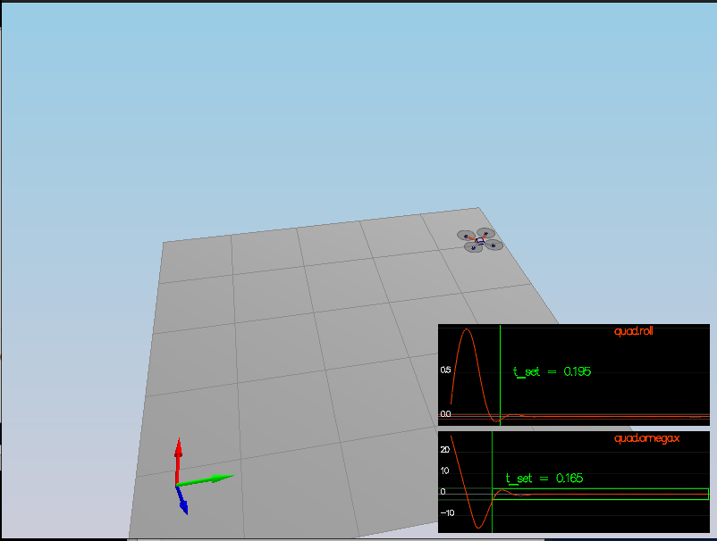
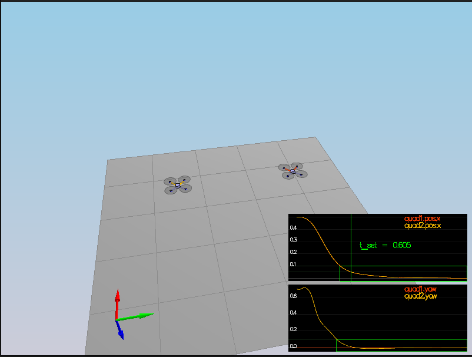
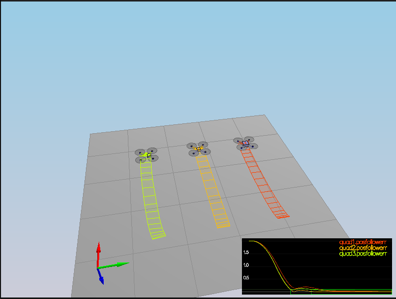

# Writeup for project submission

In this project I've implemented a cascade flight controller for a quadrotor drone.
All the addressed points have been adequately implemented in C++.




## Motor command
	
The thrust and moments is converted to the appropriate four different desired thrust forces for the moments. The `f0`-`f3` variables represent the individual desired thrust values that are later constrained by the phisical charachteristics of the actual motors.

```cpp
auto const l = L/sqrt(2.f); // this should be calculated once - but I keep it in student code section
auto const f0 = (collThrustCmd + momentCmd.x/l + momentCmd.y/l - momentCmd.z/kappa) / 4.f;
auto const f1 = (collThrustCmd - momentCmd.x/l + momentCmd.y/l + momentCmd.z/kappa) / 4.f;
auto const f2 = (collThrustCmd + momentCmd.x/l - momentCmd.y/l + momentCmd.z/kappa) / 4.f;
auto const f3 = (collThrustCmd - momentCmd.x/l - momentCmd.y/l - momentCmd.z/kappa) / 4.f;

cmd.desiredThrustsN[0] = CONSTRAIN(f0, minMotorThrust, maxMotorThrust);
cmd.desiredThrustsN[1] = CONSTRAIN(f1, minMotorThrust, maxMotorThrust);
cmd.desiredThrustsN[2] = CONSTRAIN(f2, minMotorThrust, maxMotorThrust);
cmd.desiredThrustsN[3] = CONSTRAIN(f3, minMotorThrust, maxMotorThrust);
  ```

## Body rate control

This is implemented as a simple proportional (`P`) controller that creates a momentum command based on the difference between the actual and target body rate values. `kpPQR` represents the controller gain and and the `I` is the moment of inertia.


```cpp
auto const I = V3F {Ixx, Iyy, Izz};
momentCmd = I * kpPQR * (pqrCmd-pqr);
```

## Roll pitch control

In the fist step the rotation matrix is extracted for readability.

```cpp
auto const& R11 = R(0, 0);
auto const& R12 = R(0, 1);
auto const& R13 = R(0, 2);
auto const& R21 = R(1, 0);
auto const& R22 = R(1, 1);
auto const& R23 = R(1, 2);
auto const& R33 = R(2, 2);
auto const acc = -collThrustCmd / mass;
// and some more
```
This is yet another example of a proportional (P) controller; which is implemented straight forward like so:

```cpp
pqrCmd.x = (R21 * b_c_dot.x - R11 * b_c_dot.y) / R33;
pqrCmd.y = (R22 * b_c_dot.x - R12 * b_c_dot.y) / R33;
pqrCmd.z = 0.f;
```

## Altitude controller

This is a controller that has both a proportional and an integral part.
The `P` part is stragith forwardly changes the target vertical velocity (`velZCmd`) proportinally to the error, and the result is constrained by the max allowed ascent and descent rates. 

The desited vertical acceleration is comprised by the integral part, which 'accumulates the error over time' and a simmple porportional position error.

The final return value, thrust is just obtained by applying Newtons II. law over the summarized vertical accelerations acting on the airframe.

```cpp
velZCmd += kpPosZ * (posZCmd - posZ);
velZCmd = CONSTRAIN(velZCmd, -maxAscentRate, maxDescentRate);
integratedAltitudeError += (posZCmd - posZ) * dt;
accelZCmd += KiPosZ * integratedAltitudeError + kpVelZ * (velZCmd - velZ);
thrust = mass * (CONST_GRAVITY - accelZCmd) / R(2,2);
```




## Lateral position control

First we obatin a the desired velocity (`velCmd`) which is directly proportional to the distance between the actual and commanded positions; the value is then clamped by the limitations of the vehicle.

```cpp
velCmd += kpPosXY * (posCmd - pos);
velCmd.x = CONSTRAIN(velCmd.x, -maxSpeedXY, maxSpeedXY);
velCmd.y = CONSTRAIN(velCmd.y, -maxSpeedXY, maxSpeedXY);
```

The acceleration command is obtained similarly
```cpp
accelCmd += accelCmdFF + kpVelXY * (velCmd - vel);
accelCmd.x = CONSTRAIN(accelCmd.x, -maxAccelXY, maxAccelXY);
accelCmd.y = CONSTRAIN(accelCmd.y, -maxAccelXY, maxAccelXY);'
```
The fact that this controller acts as both on the error in position(ie. distance) and the velocity makes this a PD controller.  





## Yaw control

The yaw controller is a simple `P` controller acting on the error between the commanded and actual yaw. The error is constrained between -2 $\pi$ and + 2 $\pi$.

This is the actual implementation:

```cpp
auto const yawError = fmodf(yawCmd - yaw, 2.*F_PI);
yawRateCmd = kpYaw * yawError;
```

Finally the drone handles nonlinearites 

